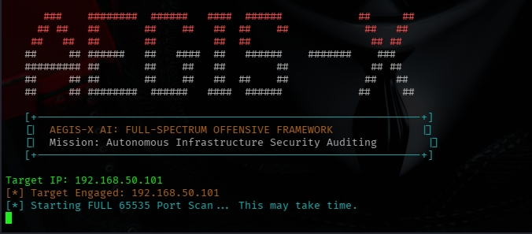
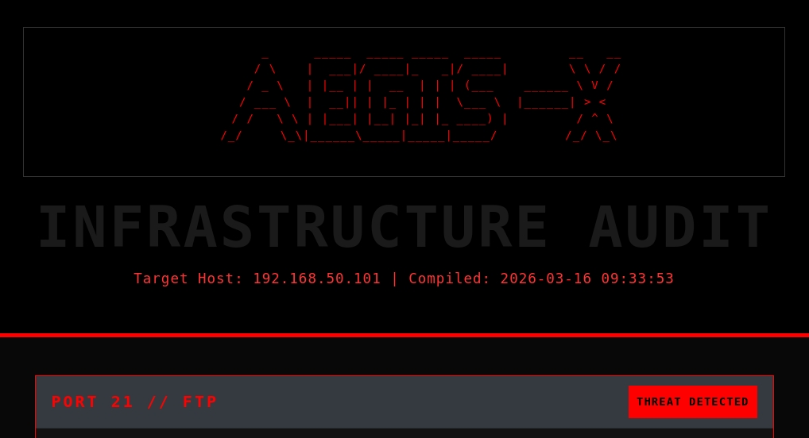
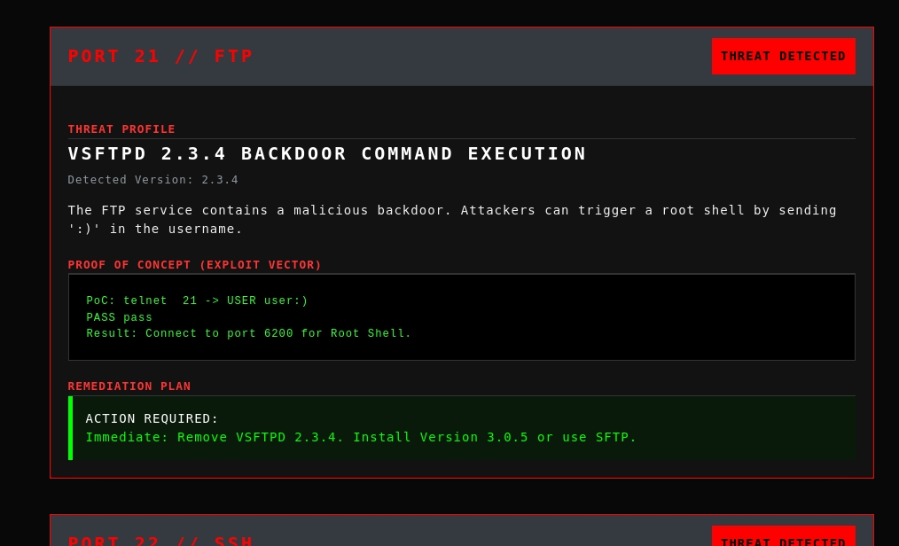

<div align="center">

# 

<p align="center">
  <a href="assets/Aegis%20X%20AI.png" target="_blank">
    
  </a>
  <br>
  <em>(Click image to enlarge)</em>
</p>

<p align="center">
  <strong>Autonomous Full-Spectrum Infrastructure Auditing & Offensive Intelligence Framework</strong>
</p>

<p align="center">
  
  
  
  
  
</p>

<p align="center">
  
  
  
  
</p>

</div>

---

<h2 align="center"> LEGAL DISCLAIMER & LICENSE</h2>

<table>
<tr>
<td>

**AUTHORIZED AUDITING ONLY**

This tool is an advanced framework for **professional security assessments and authorized research only**. It is designed for:
- Red Team operations with explicit Rules of Engagement (RoE)
- Mission-critical infrastructure auditing
- Academic cybersecurity training and vulnerability research

**PROPRIETARY NOTICE**: 
© 2026 M6D6R6. All rights reserved. Intellectual property protection enforced. 
**Redistribution, unauthorized cloning, or commercial resale is strictly prohibited without explicit written consent from the author.**

The author assumes **no responsibility** for any misuse, damage, or legal consequences resulting from unauthorized deployment.

</td>
</tr>
</table>

---

<h2 align="center"> Executive Summary</h2>

**Aegis-X AI** is an enterprise-grade offensive security framework engineered for high-fidelity reconnaissance and automated vulnerability mapping. It prioritizes the conversion of raw network data into **Actionable Offensive Intelligence**, bridging the gap between port discovery and successful remediation.

### The Challenge
Modern infrastructure auditing requires:
- Identification of non-standard services across 65,535 ports.
- Precise version fingerprinting to avoid false positives.
- Immediate correlation between service versions and exploit vectors.

### The Aegis-X Solution
Aegis-X addresses these requirements through an **autonomous multi-layered pipeline**:

| Layer | Component | Result |
|-------|------------|---------|
| **Discovery** | Full Spectrum Scan | Exhaustive mapping of all 65,535 TCP ports |
| **Fingerprinting** | Advanced NSE Engine | Precise service identification and OS detection |
| **Intelligence** | Expert Knowledge Base | Real-world PoC generation and exploit mapping |
| **Reporting** | Professional Dashboard | High-fidelity HTML reports with remediation plans |

---

<h2 align="center">📸 System Preview</h2>

<p align="center">
  <strong>Terminal Interface (C2-Style Execution)</strong><br>
  
</p>

<p align="center">
  <strong>High-Fidelity Audit Report</strong><br>
  
  
</p>

---

<h2 align="center"> Core Capabilities</h2>

### 1. Full-Spectrum Reconnaissance
- **Global Port Coverage**: Automated scanning of the entire TCP/IP stack (0-65535).
- **Evasion-Aware**: Stealth scanning options (`-Pn`) to bypass perimeter defenses.
- **Multithreaded Performance**: Optimized timing templates (`T4`) for high-speed audits.

### 2. Deep-Vulnerability Intelligence
- **NSE Integration**: Leverages Nmap Scripting Engine for real-time CVE identification.
- **PoC Database**: Built-in repository of exploit paths for mission-critical services (FTP, SMB, R-Services, Databases).

### 3. Executive Reporting & Remediation
- **Client-Ready Dashboards**: Beautifully rendered HTML reports using 'Lux' institutional styling.
- **Action Plans**: Every vulnerability includes a clear **Remediation Strategy** and hardening guide.

---

<h2 align="center"> Case Study: Metasploitable 2</h2>

Aegis-X has been rigorously validated in controlled lab environments. During the Metasploitable 2 assessment, the framework identified:

- **Critical RCE**: VSFTPD 2.3.4 Backdoor and Samba Trans2open.
- **Insecure Services**: Unauthenticated R-Services (Rsh, Rlogin) and Telnet cleartext exposure.
- **Database Leaks**: Exposed MySQL and PostgreSQL instances with remote root access.

> [!IMPORTANT]
> **[ Download the Live Audit Sample Report](examples/Audit_Report_192.168.50.101.html)**

---

## ⚖️ Legal & Ethical Disclaimer
Aegis-X AI Framework is strictly for authorized research and educational purposes. The author assumes no liability for misuse. All testing must be conducted within a pre-approved scope and with explicit written authorization (Rules of Engagement).

---
<h2 align="center"> Installation & Deployment</h2>

### Prerequisites
- Python 3.10+
- Nmap installed in system path
- Root/sudo access (for raw socket scanning)
- Linux environment (Recommended: Kali Linux)

### Quick Start
```bash
# 1. Clone the proprietary repository
git clone https://github.com/M6D6R6/Aegis-X-AI.git
cd Aegis-X-AI

# 2. Setup a Virtual Environment (Recommended for system stability)
python3 -m venv venv
source venv/bin/activate

# 3. Install offensive dependencies
pip install -r requirements.txt

# 4. Launch the Audit Framework
sudo ./venv/bin/python3 aegis_x_ai.py

```

---

<p align="center">
  <strong>Aegis-X AI</strong><br>
  <em>Forged for precision. Built for impact. Auditing the unseen.</em>
</p>

<p align="center">
  
  
  
  
</p>

---

**Keywords**: `Vulnerability Assessment` `Penetration Testing` `Nmap` `Python` `Red Team` `Network Security` `Metasploitable 2` `CVE` `Actionable Intelligence` `Aegis-X`


